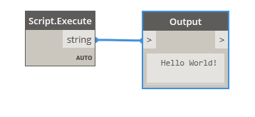

# Examples for PyScript
PyScript is simple Zero Touch Node to run python scripts in a dynamo player (http://dynamobim.org).
- The Script.Execute node finds a python file with the same name as the workspace file (.dyn) and launches it.
- Prints and errors are available for viewing from the dynamo player.
- The current folder is added to the search paths.
- To create a new script, you do not need to open dynamo: just copy any pair of <script name> .dyn / <script name> .py




## Installation
1. Find and install PyScript package.
2. Connect Script.Execute to Watch node.
3. Rename and set as output Watch node.

## Usage example
Project structure:
```
scripts/
├── isolate_warnings.dyn
├── isolate_warnings.py
├── ...
├── another_script.dyn
├── another_script.py
└── wrapper.py
```
### wrapper.py
```python
import clr

clr.AddReference('RevitAPI')
import Autodesk.Revit.DB as DB

clr.AddReference("RevitNodes")
import Revit
clr.ImportExtensions(Revit.Elements)

clr.AddReference("RevitServices")
import RevitServices
from RevitServices.Persistence import DocumentManager
from RevitServices.Transactions import TransactionManager

doc = DocumentManager.Instance.CurrentDBDocument
uiapp = DocumentManager.Instance.CurrentUIApplication
app = uiapp.Application
uidoc = uiapp.ActiveUIDocument


def transaction(f, doc=doc):
    def wrapped(*args, **kwargs):
        TransactionManager.Instance.EnsureInTransaction(doc)
        r = f(*args, **kwargs)
        TransactionManager.Instance.TransactionTaskDone()
        return r
    return wrapped
```
### isolate_warnings.py
```python
from itertools import chain
from System.Collections.Generic import List
# импорт из нашего wrapper'а
from wrapper import doc, transaction, DB


def isolate_warnings():
    warning_el_ids = get_warning_element_ids()
    if not warning_el_ids:
        return "No Warnings"

    isolate_elements(warning_el_ids)
    return "Usolated {} elements".format(len(warning_el_ids))


def get_warning_element_ids():
    warnings = doc.GetWarnings()
    element_ids = list(chain(*(w.GetFailingElements() for w in warnings)))
    return element_ids


@transaction
def isolate_elements(element_ids, view=doc.ActiveView):
    elements_to_isolate = List[DB.ElementId](element_ids)
    view.IsolateElementsTemporary(elements_to_isolate)


result = isolate_warnings()
print(result)
```
